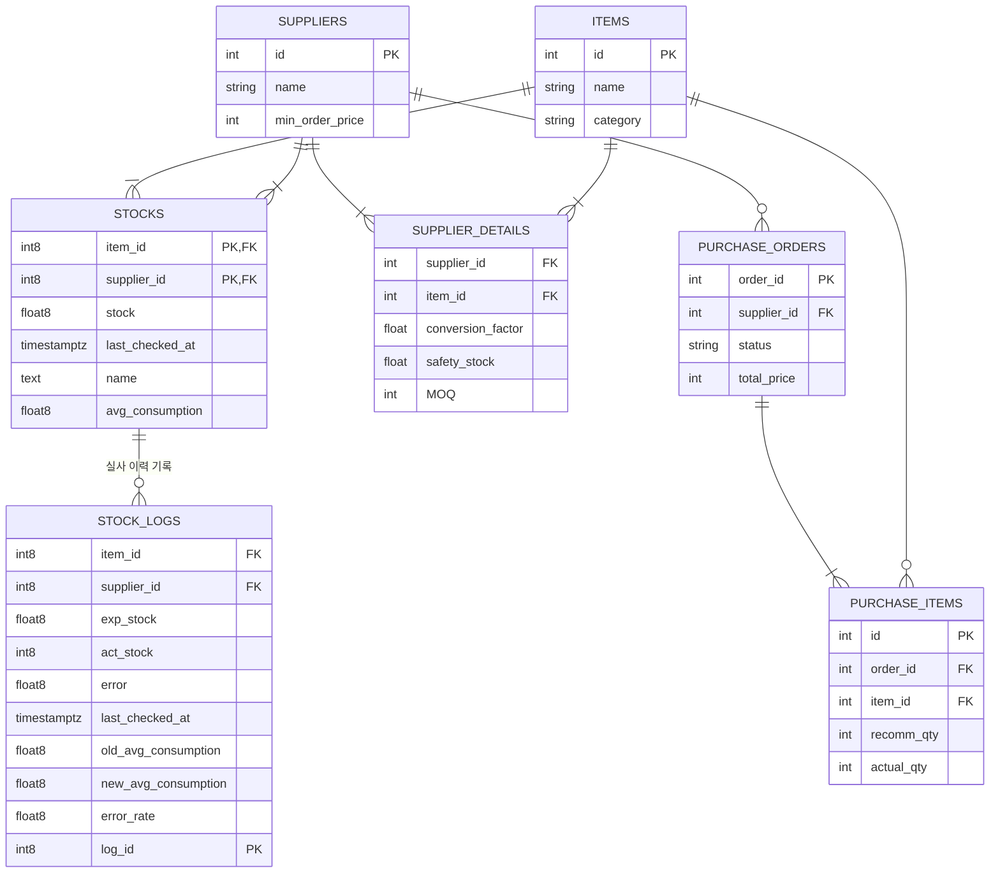
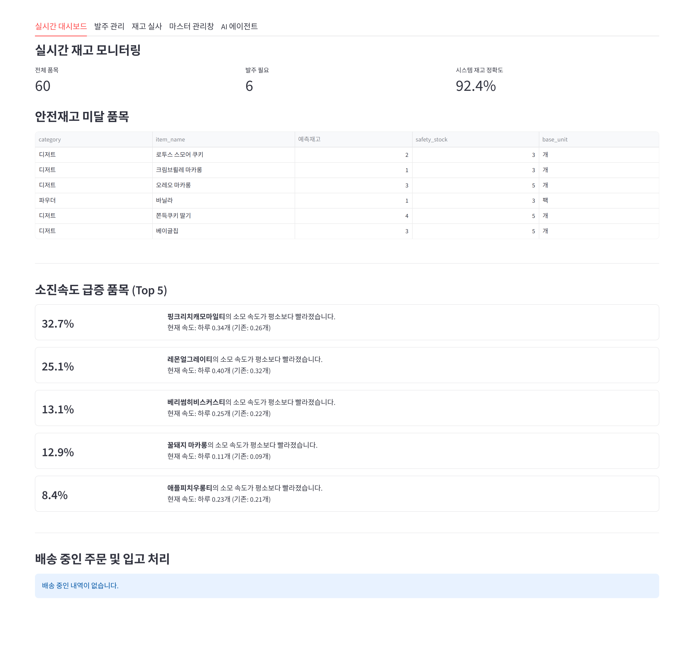
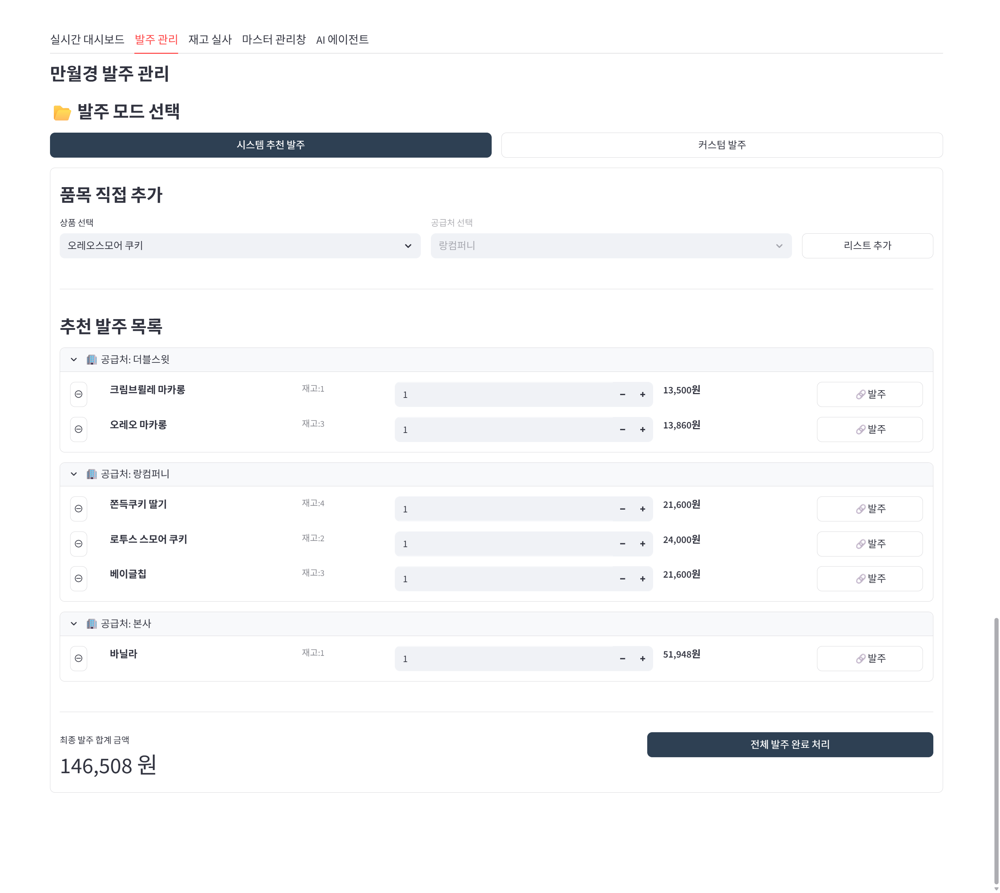
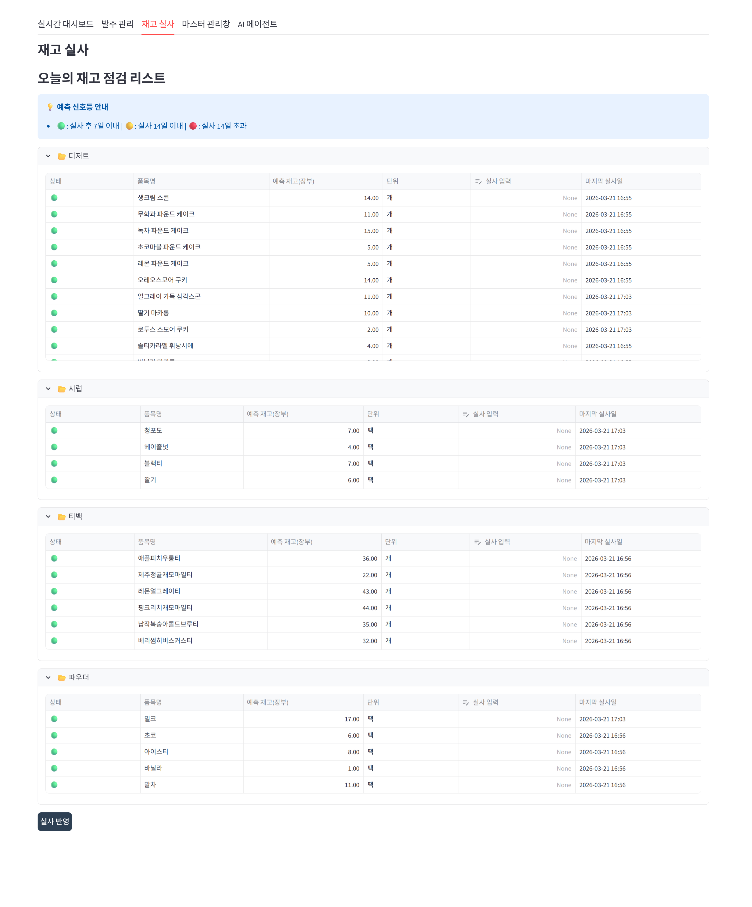
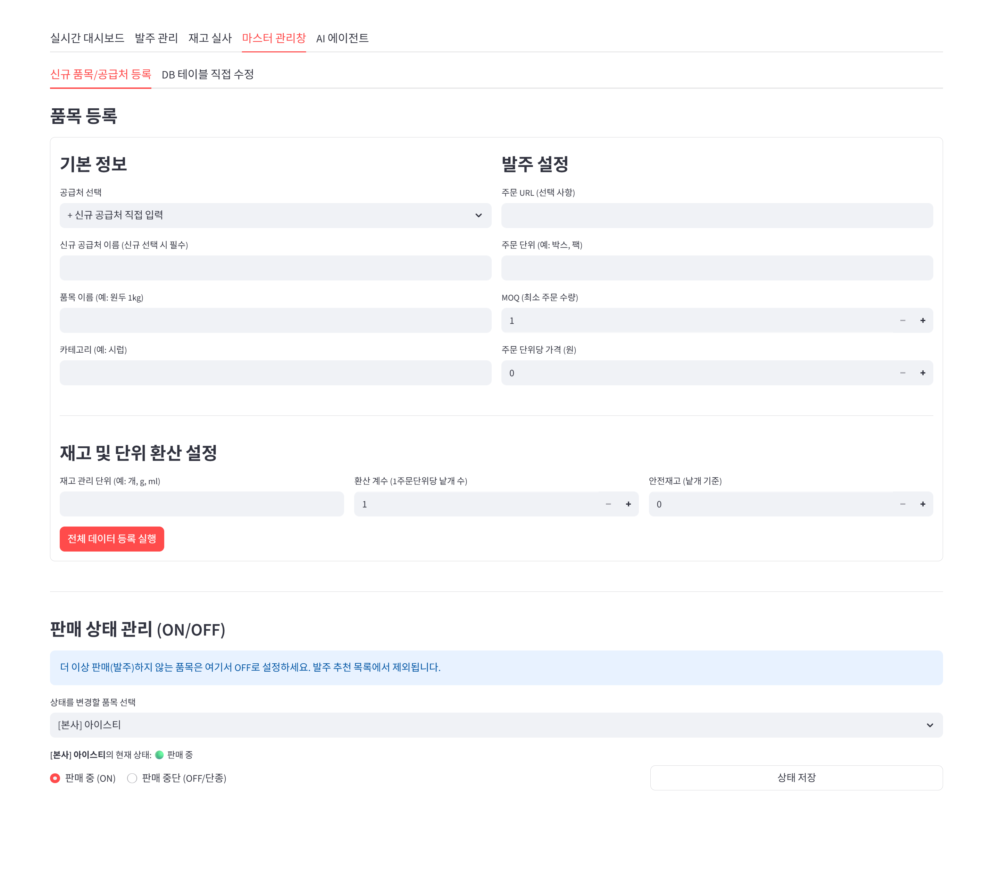
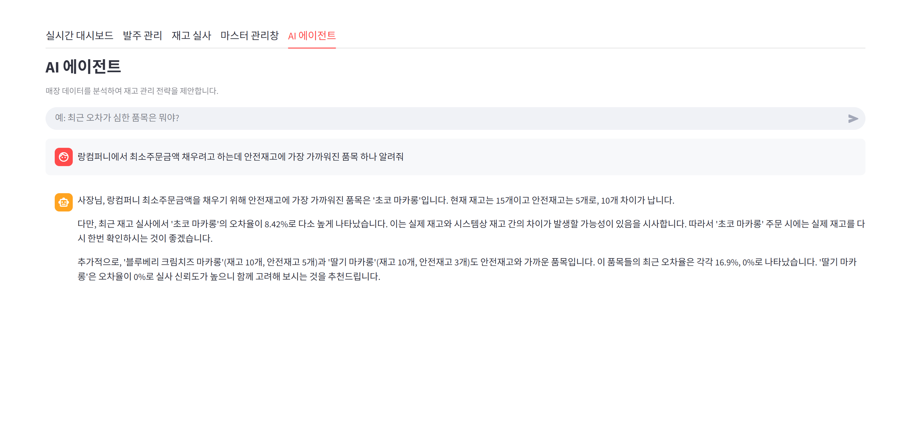

### [무인카페 '만월경' 재고관리 자동화 시스템 구축 프로젝트]

> **배경:** 디즈니월드 재고관리 수행하며 수기 재고 업데이트, 교대시 불분명한 인수인계로 지속적인 휴먼 에러를 경험. 이에 재고실사와 관리가 자동화된 시스템을 직접 개발하고 현장 적용을 통해 실효성을 검증하고자 함

---

### 1. 시스템 아키텍처
**1. Presentation Tier (UI/UX)**
- 기술 스택: Streamlit
- 설계 특징: 모든 데이터 조회 로직에 Streamlit 캐싱을 적용해 로딩 시간을 단축
- 주요 기능: 실시간 재고 대시보드 제공, 발주 인터페이스, 재고 AI Agent 채팅 UI.

**2. Logic Tier (Application)**
- 기술 스택: Python, LangChain, Google Gemini
- 설계 특징:
   - 자동 재고 차감 알고리즘: 지수평활법 기반의 일일평균재고소진량 및 IRA(재고 정확도) 산출 알고리즘을 독립 모듈로 구현
   - AI Agent: LLM(Gemini 2.5)과 재고 데이터를 결합하여 이용자의 재고관련 질문을 자연어로 답변하며, 시스템이 커버하지 못하는 정보를 제공

**3. Data Tier (Persistence)**
- 기술 스택: Supabase (PostgreSQL)
- 설계 특징:
   - 관계형 데이터 모델링: 도메인 기반 스키마 설계를 통해 데이터 중복을 최소화하고 참조 무결성을 보장
   - 실시간 데이터 동기화: 로직 계층에서 가공된 데이터가 Supabase DB에 적재되는 즉시 프레젠테이션 레이어에 반영되도록 설계

---
### 2. 데이터베이스 설계 (ERD)


**주요 테이블 설명**
- SUPPLIER_DETAILS
   - 설계목적: 발주, 입고, 재고실사에 필요한 MOQ, 안전재고, 주문단위당 개수 등을 포함
   - 핵심필드
      - MOQ : 물류 비용 최적화를 위한 최소 주문 단위 제약
      - safety_stock: 리드 타임과 수요 변동을 고려해 시스템이 유지해야 할 최소 방어 재고 기준
- STOCKS
   - 설계목적: 실사 데이터와 일일재고소진량 계산 알고리즘을 결합하여 시스템의 현재고 예측을 지원
   - 핵심필드
      - avg_consumption: 일일평균소진 예측량. 지수평활법($\alpha=0.3$)이 적용되어 (0.3 x 이번 재고실사의 일일평균소진량) + (0.7 x 기존 일일평균소진 예측량)을 계산함.
- STOCKS_LOGS
   - 설계목적: 재고실사 시 [재고 변화량], [일일평균소진 예측량 변화] 등을 기록. AI Agent가 접근권한을 갖고 있어 이용자에게 재고 트렌드 제시 가능
---

### 3. 디렉토리 구조
```text
.
├── database/                 # [Data Layer] DB 함수 및 트리거를 통한 서버 사이드 로직 관리
└── streamlit/                # [Service Layer] 사용자 인터페이스 및 비즈니스 로직 계층
    ├── Images/               # 실제 웹시스템 화면 예시  
    ├── Componenets/          # 기능별 UI 모듈화 (Admin, Dashboard, Order 등)
    ├── Utilities/            # 요일 가중치 기반 재고 예측 알고리즘 및 DB 커넥터
    └── StockManagementSystem.py # 메인 (Streamlit Main)
```
---
### 4. 웹시스템 결과물
<details>
  <summary><b>재고 대시보드</b></summary>
  <p align="center">
    
    <br>
    <em>실시간 재고 현황과 안전재고 상태를 시각화하여 모니터링</em>
  </p>
</details>

<details>
  <summary><b>발주 관리</b></summary>
  <p align="center">
    
    <br>
    <em>시스템 추천 및 커스텀 발주를 지원하며 공급처별 발주를 관리</em>
  </p>
</details>

<details>
  <summary><b>재고 실사</b></summary>
  <p align="center">
    
    <br>
    <em>재고실사를 하며 전산 재고와 실재고의 오차를 보정</em>
  </p>
</details>

<details>
  <summary><b>마스터 데이터 관리</b></summary>
  <p align="center">
    
    <br>
    <em>품목 정보, 공급처 상세 기준 및 재고 데이터를 관리</em>
  </p>
</details>

<details>
  <summary><b>AI 에이전트</b></summary>
  <p align="center">
    
    <br>
    <em>자연어 질의를 통해 재고 데이터 분석 및 운영 인사이트를 제공</em>
  </p>
</details>
